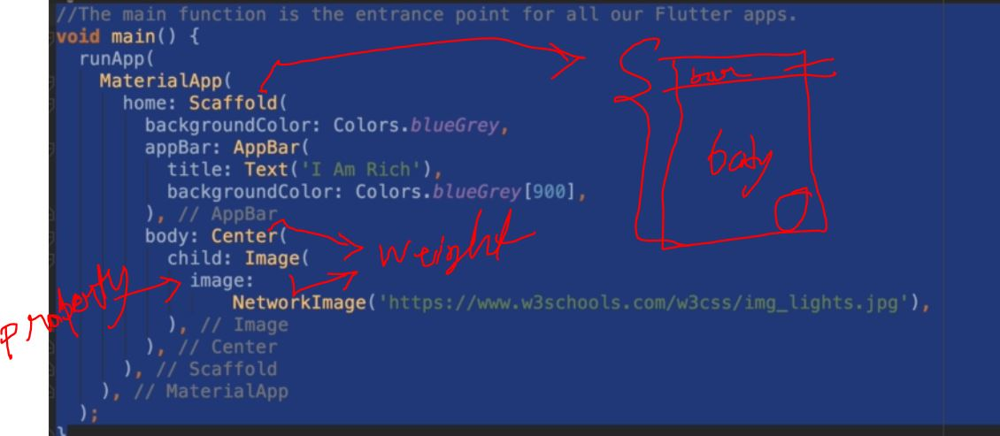

```
import 'package:flutter/material.dart';

void main() {
  runApp(
    MaterialApp //material class
        (
      //poperty
      home: Scaffold(
        backgroundColor: Colors.white70, //back ground color poperty
        appBar: AppBar(
          title: Text('i am Rich'), //wigets
          backgroundColor: Colors.red,
          centerTitle: true,
        ),
        body: Center(
          child: Image(
            //image wegit
            image: NetworkImage(
                'https://image.shutterstock.com/image-photo/northern-lights-above-reykjavik-iceland-260nw-176694704.jpg'),
          ),
        ),
      ),
    ),
  );
}

```


