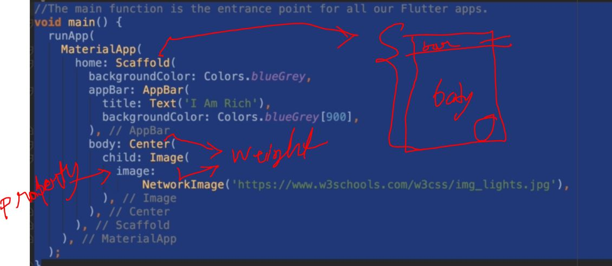

import 'package:flutter/material.dart'; 
 
void main() { 
  runApp( 
    MaterialApp //material class 
        ( 
      //poperty 
      home: Scaffold( 
        backgroundColor: Colors.white70, //back ground color poperty 
        appBar: AppBar( 
          title: Text('i am Rich'), //wigets 
          backgroundColor: Colors.red, 
          centerTitle: true, 
        ), 
        body: Center( 
          child: Image( 
            //image wegit 
            image: NetworkImage( 
                'https://image.shutterstock.com/image-photo/northern-lights-above-reykjavik-iceland-260nw-176694704.jpg'), 
          ), 
        ), 
      ), 
    ), 
  ); 
} 
 

