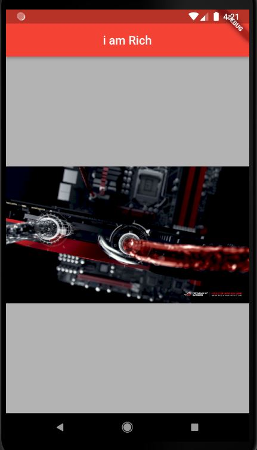

```
import 'package:flutter/material.dart';


void main() {

  runApp(

    MaterialApp //material class

        (

//poperty

      home: Scaffold(

        backgroundColor: Colors.white70, //back ground color poperty

        appBar: AppBar(

          title: Text('i am Rich'), //wigets

          backgroundColor: Colors.red,

          centerTitle: true,

        ),

        body: const Center(

          child: Image(

                  //image wegit

            image:

                  AssetImage('images/172780.jpg'),

         ),

        ),

      ),

    ),

  );

}


```


