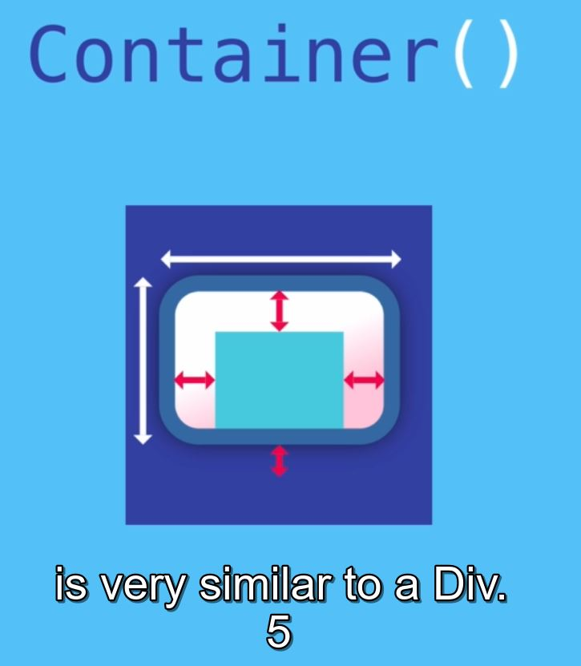

### See this url(see layout widget):    [documentation](https://flutter.dev/docs/development/ui/widgets/layout)

Most commonlly used single chiled widgets is 'container' :See this url(see layout widget):    [container](https://api.flutter.dev/flutter/widgets/Container-class.html)


```
import 'package:flutter/material.dart';

void main() {
  runApp(MyApp());
}

class MyApp extends StatelessWidget {
  @override
  Widget build(BuildContext context) {
    return MaterialApp(
      home: Scaffold(

        appBar: AppBar(/// 1st element
          title: Text('i am Rich'), //wigets
          backgroundColor: Colors.red,
          centerTitle: true,
        ),

        floatingActionButton: FloatingActionButton(/// Floating element
          backgroundColor: Colors.red,
          child: Icon(Icons.add),
        ),


        backgroundColor: Colors.teal,
        body: SafeArea(
          child: Container(/// 2nd element
            /// height width
            height: 100.0,
            width: 100,
            /// height width   END
            /// margine
            // margin: EdgeInsets.all(20), /// margine for all sides
            // margin: EdgeInsets.symmetric(vertical: 10, horizontal: 10),// top, bottom
            //margin: EdgeInsets.fromLTRB(30,60,10,10),// left, top, right, bottom,
            margin: EdgeInsets.only(left: 30, top:10),// only any of sides
            /// padding 
            padding: EdgeInsets.all(20), /// padding is similar to margine
            /// padding        END
            color: Colors.white, // text color
            child: Text('Hello'),

          ),
        ),

      ),
    );
  }
}

```