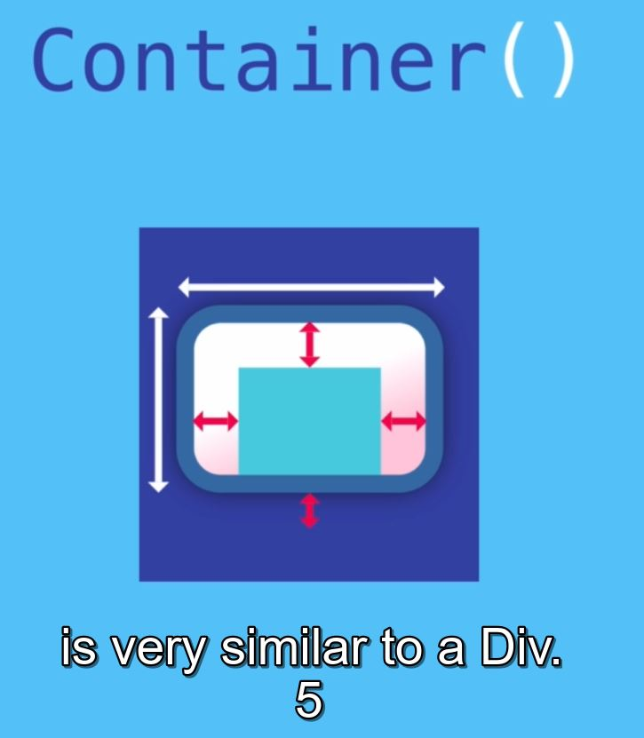
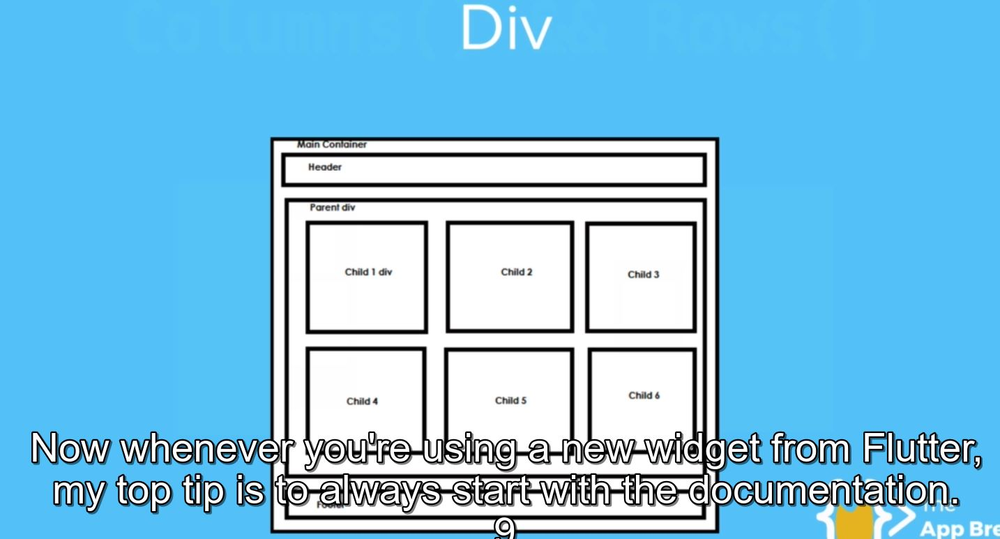

### See this url(see layout widget):    [documentation](https://flutter.dev/docs/development/ui/widgets/layout)

Most commonlly used single chiled widgets is 'container' :See this url(see layout widget):    [container](https://api.flutter.dev/flutter/widgets/Container-class.html)

